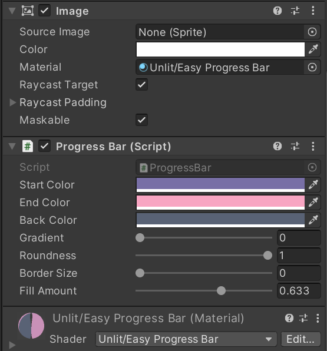

# Unity-Easy-Progress-Bar

Procedural progress bar shader for Unity UI.

* [Demo](https://drive.google.com/file/d/1DgCD72ZsK51jtRe2RFqxR1wCM5CaHYsJ/view?usp=sharing)

Features:

- Super easy to use
- No graphics needed
- Adjusts and scales automatically (horizontally & vertically)
- Supports gradient, edge roundness and adjustable border size
- Lightweight and supports all rendering pipelines
- 1 progress bar = 1 draw call

